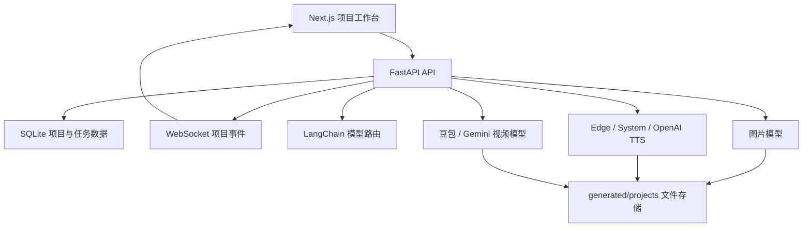
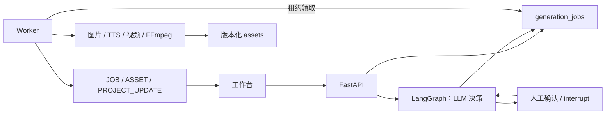

# SceneFlow AI 短剧 / 漫剧编排与代码审查文档

> 版本：V1.0  
> 日期：2026-07-21  
> 范围：当前代码结构、编排架构、LangGraph 边界、中断恢复、回滚与后续开发顺序。

## 1. 结论

SceneFlow 不需要用 LangGraph 统一编排整个短剧生产线。推荐混合架构：

- LangGraph：剧本理解、角色/地点提取、连续性检查、人工确认等 LLM 决策流程。
- `generation_jobs + worker`：图片、TTS、视频、字幕、FFmpeg 等确定性长任务。
- SQLite：MVP 的项目状态、任务租约、幂等、失败重试和人工中断点。
- 版本化资产：实现业务回滚，不直接删除已经生成的素材。

LangGraph 已随 LangChain 1.3.12 安装，当前版本为 1.2.7，无需新增依赖。

## 2. 当前实际架构



当前已完成：

- 项目生产设置前后端持久化。
- `generation_jobs` 表和入队、幂等、租约、取消、重试服务。
- Edge-TTS、本地 System TTS、OpenAI compatible TTS。
- 场景真实图片和真实语音生成。
- 模型管理、余额、价格和用量基础。

当前未完成：

- 独立 worker processor。
- 现有图片/TTS/视频统一通过 job 入队。
- 前端任务中心和取消/重试操作。
- 角色、地点、资产版本和字幕时间轴。
- FFmpeg 预览、正式导出和项目镜头视频化。

## 3. 为什么不让 LangGraph 管全部任务

LangGraph 擅长：

- LLM 节点之间的条件分支。
- checkpoint 和人工确认后继续。
- 根据结构化结果决定下一步。
- 剧本修改后只重跑受影响的分析节点。

LangGraph 不应直接承担：

- 数分钟的视频模型轮询。
- 大文件图片、音频和视频状态。
- FFmpeg 子进程生命周期。
- 供应商重试、扣费幂等和 worker 崩溃恢复。

这些任务必须以数据库 job 为事实源，否则 API/Agent 进程退出时容易丢任务或重复扣费。

## 4. 推荐目标架构



职责规则：

| 需求 | 负责组件 |
|---|---|
| 剧本拆解、角色地点提取 | LangGraph |
| 人工确认角色设定 | LangGraph interrupt/checkpoint |
| 批量生成分镜图 | generation job + worker |
| TTS 与字幕音频 | generation job + worker |
| 图生视频与状态轮询 | generation job + worker |
| FFmpeg 合成 | generation job + worker |
| 当前选择、资产版本 | 业务表与 assets |
| 实时进度 | WebSocket 事件 |

## 5. 建议生产流程

```text
draft
  → script_structuring
  → awaiting_story_confirmation
  → bible_generating
  → awaiting_bible_confirmation
  → storyboard_generating
  → awaiting_storyboard_confirmation
  → audio_generating
  → timeline_ready
  → preview_generating
  → export_ready
```

其中 `awaiting_*` 是 LangGraph/业务人工中断点；`*_generating` 是持久化 job 阶段。

## 6. 中断、恢复和回滚

### 6.1 中断

- 用户主动暂停：不再创建新 job；运行中的供应商请求按能力取消或等待结束。
- 人工确认：LangGraph 保存结构化 checkpoint，项目状态进入 `awaiting_*`。
- 服务重启：worker 租约过期后其他 worker 重新领取。

### 6.2 恢复

- job 使用 `idempotency_key` 防止重复提交。
- worker 领取时增加 `attempt` 并设置 `lease_owner/lease_expires_at`。
- 成功结果先写资产，再原子更新 job 和当前版本指针。
- WebSocket 只用于通知，刷新后始终从数据库恢复真实状态。

### 6.3 回滚

不做数据库事务意义上的“删除式回滚”。AI 素材生成有外部成本，正确做法是：

1. 每次生成创建新资产版本。
2. 项目/镜头只保存当前选中版本 ID。
3. 回滚时切换当前版本指针。
4. 将依赖该版本的下游资产标记为 `stale`。
5. 用户确认后重新生成受影响的下游任务。

## 7. 本轮代码审查结果

已修复：

- 图片模型缺失时错误回退到文本模型。
- generation job 幂等键跨项目误命中。
- OpenAI TTS 使用错误的 `format` 字段。
- Edge-TTS 回退到 Linux 时使用不兼容音色。
- TTS 音频时长仅按字符估算，现改为 FFprobe 读取真实时长并保留兜底。
- 前端目标时长与后端允许范围不一致。
- API 可保存画幅与宽高不匹配的生产设置。
- 免费 TTS 切换时可能残留上一个供应商 API Key。

刻意未做：

- 没有为一个 worker 提前引入 Celery、Temporal、Redis 或 Kafka。
- 没有手写 MP3/WAV 解析；复用 FFprobe。
- 没有用 LangGraph 包装确定性媒体调用。
- 没有立即实现通用 DAG、插件系统或多 Agent 团队。

## 8. 第三方组件选择

| 能力 | 选择 | 原因 |
|---|---|---|
| LLM 决策图 | LangGraph（已安装） | checkpoint、interrupt、条件路由 |
| 免费 TTS | Edge-TTS | 开源、无需 API Key、音色丰富 |
| 离线语音回退 | macOS `say` / Linux `espeak-ng` | 无额外服务依赖 |
| 音频时长 | FFprobe | 已部署、格式支持稳定，避免手写解析 |
| 媒体合成 | FFmpeg | 成熟、支持运镜、字幕、混音和编码 |
| MVP 任务队列 | SQLite generation jobs | 当前单机规模足够，最少基础设施 |

未采用 `mutagen` 作为项目依赖：其 GPL-2.0-or-later 许可证需要额外合规评估，当前已有 FFprobe 能满足需求。

## 9. 下一步开发顺序

1. 实现最小 `worker.py`，处理现有 `generation_jobs`。
2. 把分镜图片和 TTS 从 `asyncio.create_task` 迁移到 job。
3. 增加前端任务列表、进度、取消和失败重试。
4. 增加角色/地点和版本化 assets。
5. 为剧本结构化与人工确认引入第一个 LangGraph。
6. 增加字幕 cue、FFmpeg 预览和导出。
7. 将项目镜头接入现有图生视频服务。

LangGraph 的第一条实际流程只覆盖：

```text
剧本文本 → 结构化提取 → 规则校验 → 人工确认 → 保存角色/地点/镜头
```

不在第一条图中调用图片、TTS、视频或 FFmpeg。

## 10. 验证结果

- 后端全量测试：通过。
- Python `compileall`：通过。
- 前端 ESLint：通过。
- TypeScript：通过。
- `git diff --check`：通过。

