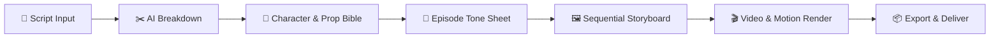
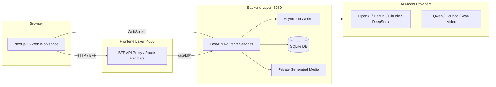

# SceneFlow

<div align="center">

# 🎬 SceneFlow
### The Open-Source Multi-Modal AI Production Studio for Short Dramas & Motion Comics

<p align="center">
  <b>English</b> · <a href="README_zh.md">简体中文</a>
</p>

[](LICENSE)
[](https://nextjs.org/)
[](https://react.dev/)
[](https://www.python.org/)
[](https://fastapi.tiangolo.com/)
[](https://tailwindcss.com/)

[Architecture Docs](docs/architecture/overview.md) · [Report Bug / Request Feature](https://github.com/TorresLi608/SceneFlow/issues) · [Discussions](https://github.com/TorresLi608/SceneFlow/discussions)

</div>

---

## 📖 Overview

**SceneFlow** is a modern, full-pipeline AI production workspace engineered for creators making short dramas, cinematic series, and motion comics. It turns script text into structured scenes and shots, renders high-fidelity visual storyboards and motion clips, and maintains character and prop visual continuity across entire seasons.

The system runs on a clean decoupled architecture: a **Next.js 16** frontend (BFF proxy, reactive editor, and chat assistant) and a **FastAPI + SQLite** backend (model routing, background job queue, and signed media serving).

> [!IMPORTANT]
> **SceneFlow is under active open-source development.** AI-generated content carries inherent randomness. Always review assets before publishing or commercial distribution, and ensure you possess appropriate intellectual property and portrait/voice rights.

---

## ✨ Key Highlights

- 📝 **Intelligent Script Breakdown**: Decompose scripts into granular, structured shot metadata (narration, dialogue, speaker, composition, camera moves, transitions, and duration).
- 🎭 **Series Continuity Bible**: Maintain cast faces, costumes, turnaround sheets, voice profiles, and prop cards across episodes using character states and merged reference sheets.
- 🎨 **Two-Pass Storyboard Anchor**: Approve an episode-wide **Tone Sheet** first to lock in color palette, style, and lighting before rendering full-resolution sequential shots.
- ⚡ **Multi-Model Routing**: Mix and match text, image, video, and voice models per project (OpenAI, Google Gemini, Qwen/Wan, ByteDance Doubao Seedance, DeepSeek, Anthropic, or custom OpenAI-compatible endpoints).
- 💬 **AI Production Copilot**: Embedded conversational assistant with context compression, prompt refinement, and real-time streaming output.
- 🔒 **Secure Expiring Media**: Assets are stored safely with relative paths and served via time-limited, backend-signed URLs.
- 🌐 **Full Bilingual UI**: Complete internationalization support for both **English** and **简体中文**.

---

## 🔄 Production Workflow



1. **Project & Script Setup**: Create a series and import raw episode scripts.
2. **Model & Cast Setup**: Configure AI providers, design character looks, turnaround sheets, and timbre references.
3. **Breakdown**: Parse text into separate frame (visual) and motion (camera) prompts.
4. **Tone Sheet**: Resample and approve the episode anchor style.
5. **Storyboard & Video**: Sequentially generate storyboard frames and animate clips.
6. **Workspace Polish**: Review, regenerate, lock, and manage assets in the visual editor.

---

## 🏗️ System Architecture



- [Architecture Overview](docs/architecture/overview.md)
- [Module Boundaries](docs/architecture/boundaries.md)
- [End-to-End Data Flow](docs/architecture/data-flow.md)
- [Local Setup Runbook](docs/reference/local-setup.md)

---

## 🛠️ Technology Stack

| Layer | Stack |
|---|---|
| **Frontend** | Next.js 16, React 19, TypeScript, Tailwind CSS 4, React Query, Zustand, assistant-ui, AI SDK |
| **Backend** | Python 3.11, FastAPI, Uvicorn, SQLModel, SQLAlchemy 2, Alembic |
| **AI Orchestration** | LangChain, LangGraph, Dynamic Model Router |
| **Media & Storage** | SQLite, Pillow, FFmpeg / FFprobe, Expiring HMAC Signed Storage |
| **Container** | Docker, Docker Compose |

---

## 🚀 Quick Start with Docker

The fastest way to deploy and explore SceneFlow locally.

### Prerequisites

- **Git**
- **Docker Engine / Docker Desktop** (with Docker Compose v2)

### One-Command Setup

```bash
# 1. Clone repository
git clone https://github.com/TorresLi608/SceneFlow.git
cd SceneFlow

# 2. Prepare environment file
cp backend/.env.example backend/.env

# 3. Start with Docker Compose
docker compose up -d --build
```

You can also use root `pnpm` convenience scripts:

```bash
pnpm run docker:up       # Build & start in background
pnpm run docker:backup   # Backup database & media snapshot
```

### Access URLs

| Service | URL | Note |
|---|---|---|
| **Web Workspace** | [http://127.0.0.1:4000](http://127.0.0.1:4000) | Frontend Studio |
| **Backend Health** | [http://127.0.0.1:8080/healthz](http://127.0.0.1:8080/healthz) | `{"status":"ok"}` |
| **OpenAPI Docs** | [http://127.0.0.1:8080/docs](http://127.0.0.1:8080/docs) | Swagger UI |

Default Super Administrator (Development only):
* **Username**: `superAdmin`
* **Password**: `superAdmin@123`

---

## 💻 Local Development

### Prerequisites

- **Python 3.11**
- **Node.js 22+** & **pnpm 10+**
- **FFmpeg & FFprobe** (installed and added to PATH)
- **Git**

### 1. Clone & Install Dependencies

```bash
git clone https://github.com/TorresLi608/SceneFlow.git
cd SceneFlow

# Install backend virtual environment (.venv) & dependencies
pnpm run install:backend

# Install frontend dependencies
pnpm run install:frontend
```

### 2. Configure Environment Files

**macOS / Linux / Git Bash:**
```bash
cp backend/.env.example backend/.env
cp frontend/.env.example frontend/.env.local
```

**Windows PowerShell:**
```powershell
Copy-Item backend/.env.example backend/.env
Copy-Item frontend/.env.example frontend/.env.local
```

### 3. Run Backend & Frontend

In Terminal 1 (Backend):
```bash
pnpm run dev:backend
```

In Terminal 2 (Frontend):
```bash
pnpm run dev:frontend
```

Visit [http://localhost:4000](http://localhost:4000) in your browser.

---

## ⚙️ Environment Variables Reference

### Backend Configuration (`backend/.env`)

| Variable | Default | Description |
|---|---|---|
| `PORT` | `8080` | Backend port |
| `SCENEFLOW_ENV` | `development` | Environment mode (`development` / `production`) |
| `SCENEFLOW_DB_PATH` | `./sceneflow.db` | SQLite database file path |
| `SCENEFLOW_PRIVATE_GENERATED_DIR` | `./private_generated` | Private media storage directory |
| `SCENEFLOW_PUBLIC_BASE_URL` | `http://127.0.0.1:8080` | Public backend URL for signed media links |
| `SCENEFLOW_JWT_SECRET` | *(Dev default)* | JWT secret (Must replace in production) |
| `SCENEFLOW_AES_KEY` | *(Dev default)* | Key encryption master secret (Must replace in production) |
| `SCENEFLOW_SUPER_ADMIN_PASSWORD` | `superAdmin@123` | Initial super admin password |
| `SCENEFLOW_CORS_ORIGINS` | `http://localhost:4000` | Allowed CORS origins (comma-separated) |
| `SCENEFLOW_MAX_CONTEXT_TOKENS` | `100000` | Maximum token budget for chat context |
| `SCENEFLOW_LOG_LEVEL` | `INFO` | Logging verbosity |

### Frontend Configuration (`frontend/.env.local`)

| Variable | Default | Description |
|---|---|---|
| `BACKEND_API_BASE_URL` | `http://127.0.0.1:8080` | Next.js server-side BFF proxy target |
| `NEXT_PUBLIC_BFF_BASE_URL` | `""` | Client-side BFF base URL (empty = same origin) |
| `NEXT_PUBLIC_WS_BASE_URL` | `ws://127.0.0.1:8080` | Browser WebSocket server URL |

---

## 🧪 Testing & Pre-Commit Checks

```bash
# Run backend tests
cd backend
sh scripts/run_tests.sh $(ls tests/test_*.py | xargs -n1 basename | sed 's/\.py$//')

# Run frontend typecheck & lint
cd ../frontend
pnpm exec tsc --noEmit
pnpm lint
node --no-warnings --experimental-strip-types --test src/lib/money.test.mts
```

---

## 📁 Repository Structure

```text
SceneFlow/
├── backend/                 # FastAPI app, SQLModel schemas, services, migrations, tests
├── frontend/                # Next.js 16 app, BFF routes, zustand stores, UI primitives
├── docs/                    # Architecture, design specs, conventions, and roadmaps
├── scripts/                 # Cross-platform development runners (Mac / Windows / Linux)
├── docker-compose.yml       # Production/development Docker orchestration
├── LICENSE                  # GNU AGPL v3 License
└── DISCLAIMER.md            # Bilingual Disclaimer
```

---

## 🤝 Contributing

We warmly welcome issues, feedback, and pull requests!

1. Check our [Architecture Overview](docs/architecture/overview.md) and [Coding Conventions](docs/conventions/README.md).
2. For UI changes, ensure all visible strings are added to both `zh` and `en` in `frontend/src/lib/i18n.ts`.
3. Verify changes with backend tests and frontend `pnpm exec tsc --noEmit`.
4. Open a pull request against `main`.

---

## 📄 License & Disclaimer

- **License**: SceneFlow is licensed under the [GNU Affero General Public License v3.0 or later](LICENSE) (`AGPL-3.0-or-later`).
- **Disclaimer**: Please read [DISCLAIMER.md](DISCLAIMER.md) regarding AI generation output review, third-party provider terms, intellectual property, and usage costs.

<div align="center">

**Made with ❤️ for AI Creators Worldwide**

</div>
