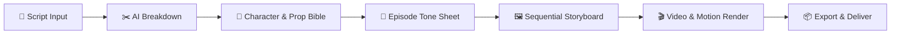
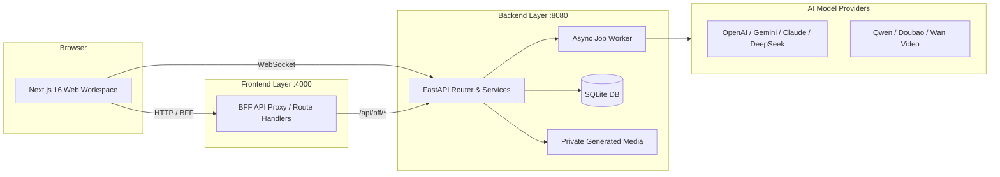

<div align="center">

# 🎬 SceneFlow
### The Open-Source Multi-Modal AI Production Studio for Short Dramas & Motion Comics

<p align="center">
  <b>English</b> · <a href="README_zh.md">简体中文</a>
</p>

[](LICENSE)
[](https://nextjs.org/)
[](https://react.dev/)
[](https://www.python.org/)
[](https://fastapi.tiangolo.com/)
[](https://tailwindcss.com/)

[Architecture Docs](docs/architecture/overview.md) · [Report Bug / Request Feature](https://github.com/TorresLi608/SceneFlow/issues) · [Discussions](https://github.com/TorresLi608/SceneFlow/discussions)

</div>

---

## 📖 Overview

**SceneFlow** is a modern, full-pipeline AI production workspace engineered for creators making short dramas, cinematic series, and motion comics. It turns script text into structured scenes and shots, renders high-fidelity visual storyboards and motion clips, and maintains character and prop visual continuity across entire seasons.

The system runs on a clean decoupled architecture: a **Next.js 16** frontend (BFF proxy, reactive editor, and chat assistant) and a **FastAPI + SQLite** backend (model routing, background job queue, and signed media serving).

> [!IMPORTANT]
> **SceneFlow is under active open-source development.** AI-generated content carries inherent randomness. Always review assets before publishing or commercial distribution, and ensure you possess appropriate intellectual property and portrait/voice rights.

---

## ✨ Key Highlights

- 📝 **Intelligent Script Breakdown**: Decompose scripts into structured shots — narration, dialogue, speaker, shot size, composition prompt, camera move, transition, and duration. The frame side and the motion side are separate fields, so re-deriving camera work never discards frames you already rendered.
- 🎭 **Series Continuity Bible**: Character cards, per-episode character states, turnaround sheets, props, and voice profiles. References are merged into one sheet before they reach the renderer, so a cast of any size keeps its faces and costumes across episodes.
- 🎨 **Two-Pass Storyboard Anchor**: Approve an episode-wide **Tone Sheet** to lock palette, lighting, and render style before paying for full-resolution shots.
- ⚡ **Multi-Model Routing**: Pick text, image, video, and voice models per project, falling back to the account default (OpenAI, Google Gemini, Qwen/Wan, ByteDance Doubao Seedance, DeepSeek, Anthropic, or any OpenAI-compatible endpoint).
- 💬 **AI Production Copilot**: Conversational assistant with session history, context compression, media attachments, and streaming output.
- 🔒 **Secure Expiring Media**: Assets are stored as relative paths and served only through time-limited, backend-signed HMAC links.
- 🌐 **Full Bilingual UI**: Complete internationalization for both **English** and **简体中文**.

---

## 🔄 Production Workflow



1. **Project & script** — create a series, then import each episode's script.
2. **Models & bible** — set a provider per purpose, then design character states, turnaround sheets, props, and voice profiles. What you draw here is what holds faces steady later.
3. **Breakdown** — split the script into shots. `target` chooses which half is produced, so motion can be re-derived without touching rendered frames.
4. **Tone sheet** — one image sampling the whole episode. It is the style anchor, never a deliverable, and it is approved before any full-resolution frame is paid for.
5. **Storyboard & clips** — shots render *sequentially*, each carrying the tone sheet, the merged cast sheet, and the previous shot's frame; clips are then generated per shot.
6. **Polish & export** — regenerate individual shots, lock the approved ones so a batch rerun skips them, and merge a selection into the final deliverable.

---

## 🏗️ System Architecture



- [Architecture Overview](docs/architecture/overview.md)
- [Module Boundaries](docs/architecture/boundaries.md)
- [End-to-End Data Flow](docs/architecture/data-flow.md)
- [Local Setup Runbook](docs/reference/local-setup.md)

---

## 🛠️ Technology Stack

| Layer | Stack |
|---|---|
| **Frontend** | Next.js 16, React 19, TypeScript, Tailwind CSS 4, React Query, Zustand, assistant-ui, AI SDK |
| **Backend** | Python 3.11, FastAPI, Uvicorn, SQLModel, SQLAlchemy 2, Alembic |
| **AI Orchestration** | LangChain, LangGraph, Dynamic Model Router |
| **Media & Storage** | SQLite, Pillow, FFmpeg / FFprobe, Expiring HMAC Signed Storage |
| **Container** | Docker, Docker Compose |

---

## 🚀 Quick Start with Docker

The fastest way to deploy and explore SceneFlow locally.

### Prerequisites

- **Git**
- **Docker Engine / Docker Desktop** (with Docker Compose v2)

### One-Command Setup

```bash
# 1. Clone repository
git clone https://github.com/TorresLi608/SceneFlow.git
cd SceneFlow

# 2. Prepare environment file
cp backend/.env.example backend/.env

# 3. Start with Docker Compose
docker compose up -d --build
```

You can also use root `pnpm` convenience scripts:

```bash
pnpm run docker:up       # Build & start in background
pnpm run docker:backup   # Backup database & media snapshot
```

### Access URLs

| Service | URL | Note |
|---|---|---|
| **Web Workspace** | [http://127.0.0.1:4000](http://127.0.0.1:4000) | Frontend Studio |
| **Backend Health** | [http://127.0.0.1:8080/healthz](http://127.0.0.1:8080/healthz) | `{"status":"ok"}` |
| **OpenAPI Docs** | [http://127.0.0.1:8080/docs](http://127.0.0.1:8080/docs) | Swagger UI |

Default Super Administrator (Development only):
* **Username**: `superAdmin`
* **Password**: `superAdmin@123`

---

## 💻 Local Development

### Prerequisites

- **Python 3.11**
- **Node.js 22+** & **pnpm 10+**
- **FFmpeg & FFprobe** (installed and added to PATH)
- **Git**

### 1. Clone & Install Dependencies

```bash
git clone https://github.com/TorresLi608/SceneFlow.git
cd SceneFlow

# Install backend virtual environment (.venv) & dependencies
pnpm run install:backend

# Install frontend dependencies
pnpm run install:frontend
```

### 2. Configure Environment Files

**macOS / Linux / Git Bash:**
```bash
cp backend/.env.example backend/.env
cp frontend/.env.example frontend/.env.local
```

**Windows PowerShell:**
```powershell
Copy-Item backend/.env.example backend/.env
Copy-Item frontend/.env.example frontend/.env.local
```

### 3. Run Backend & Frontend

In Terminal 1 (Backend):
```bash
pnpm run dev:backend
```

In Terminal 2 (Frontend):
```bash
pnpm run dev:frontend
```

Visit [http://localhost:4000](http://localhost:4000) in your browser.

---

## ⚙️ Environment Variables

`backend/.env.example` and `frontend/.env.example` are the reference — every variable is listed there with a bilingual comment, and the defaults work as-is for local development. Only the ones below usually need your attention.

### Backend (`backend/.env`)

| Variable | Default | Description |
|---|---|---|
| `SCENEFLOW_JWT_SECRET` | *(dev default)* | JWT signing secret. **Production startup refuses to boot on the dev value.** |
| `SCENEFLOW_AES_KEY` | *(dev default)* | Master key encrypting stored provider API keys. **Same refusal applies.** |
| `SCENEFLOW_SUPER_ADMIN_PASSWORD` | `superAdmin@123` | Initial super-admin password. **Same refusal applies.** |
| `SCENEFLOW_ENV` | `development` | Set to `production` to enable the checks above. |
| `SCENEFLOW_PUBLIC_BASE_URL` | `http://127.0.0.1:8080` | Backend address baked into signed media links — must be reachable by the browser. |
| `SCENEFLOW_CORS_ORIGINS` | `http://localhost:4000,http://127.0.0.1:4000` | Allowed frontend origins, comma-separated. |
| `SCENEFLOW_DB_PATH` | `./sceneflow.db` | SQLite file; relative paths resolve from `backend/`. |
| `SCENEFLOW_PRIVATE_GENERATED_DIR` | `./private_generated` | Generated media directory. Back this up together with the database. |

The full list — port, log level, context budget, and CJK font overrides — is in [`backend/README.md`](backend/README.md#environment).

### Frontend (`frontend/.env.local`)

| Variable | Default | Description |
|---|---|---|
| `BACKEND_API_BASE_URL` | `http://127.0.0.1:8080` | Next.js server-side BFF proxy target. |
| `NEXT_PUBLIC_BFF_BASE_URL` | `""` | Client-side BFF base URL; empty means same origin. |
| `NEXT_PUBLIC_WS_BASE_URL` | `ws://127.0.0.1:8080` | Browser WebSocket URL for render progress. |

---

## 🧪 Testing & Pre-Commit Checks

```bash
# Backend — one process and one throwaway database per file
cd backend
sh scripts/run_tests.sh $(ls tests/test_*.py | xargs -n1 basename | sed 's/\.py$//')

# Frontend
cd ../frontend
pnpm exec tsc --noEmit
pnpm lint
node --no-warnings --experimental-strip-types --test src/lib/money.test.mts
```

There is no pytest here: backend tests are plain modules that call their own test functions and drive the real ASGI app through `TestClient`. Use `scripts/run_tests.sh` rather than `tests/run_all.py` — the latter runs every file in one process, so state leaks between files and the first failure aborts the rest.

---

## 📁 Repository Structure

```text
SceneFlow/
├── backend/                 # FastAPI app, SQLModel schemas, services, migrations, tests
├── frontend/                # Next.js 16 app, BFF routes, zustand stores, UI primitives
├── docs/                    # Architecture, conventions, feature designs, and generated reference
├── scripts/                 # Cross-platform install & dev runners (macOS / Windows / Linux)
└── docker-compose.yml       # Container orchestration
```

---

## 🤝 Contributing

Issues, feedback, and pull requests are welcome.

1. Read the [Architecture Overview](docs/architecture/overview.md) and [Coding Conventions](docs/conventions/README.md) first — the conventions list the rules that break things silently when violated.
2. For UI changes, add every visible string to **both** `zh` and `en` in `frontend/src/lib/i18n.ts`.
3. Pass the checks above, and regenerate `docs/reference/api-spec.yaml` if you touched an endpoint or a request model.
4. Open a pull request against `main`.

---

## 📄 License & Disclaimer

- **License**: SceneFlow is licensed under the [GNU Affero General Public License v3.0 or later](LICENSE) (`AGPL-3.0-or-later`).
- **Disclaimer**: Please read [DISCLAIMER.md](DISCLAIMER.md) regarding AI generation output review, third-party provider terms, intellectual property, usage costs, and what support to expect.