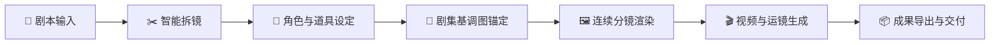
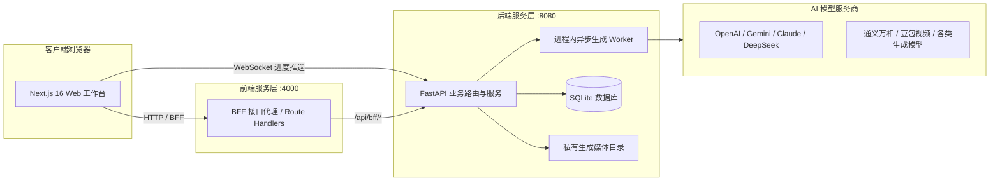

<div align="center">

# 🎬 SceneFlow
### 全能型多模态 AI 短剧与动态漫创作生产工作台

<p align="center">
  <a href="README.md">English</a> · <b>简体中文</b>
</p>

[](LICENSE)
[](https://nextjs.org/)
[](https://react.dev/)
[](https://www.python.org/)
[](https://fastapi.tiangolo.com/)
[](https://tailwindcss.com/)

[架构设计文档](docs/architecture/overview.md) · [提交 Issue / 功能建议](https://github.com/TorresLi608/SceneFlow/issues) · [社区讨论](https://github.com/TorresLi608/SceneFlow/discussions)

</div>

---

## 📖 项目简介

**SceneFlow** 是一个专为 AI 短剧、动态漫与影视内容创作者打造的开源全流程生产工作台。它能够将剧本文本智能拆解为结构化镜头，围绕每个镜头生成高清分镜画面、运镜提示词与动态视频素材，并通过角色状态卡、道具设定、三视图参考图以及剧集基调图，深度保证跨镜头与跨剧集的视觉连续性与一致性。

系统采用现代化前后端分离架构：**Next.js 16** 前端（BFF 代理转发、响应式分镜工作台与 AI 创作助手）搭配 **FastAPI + SQLite** 后端（多模型路由编排、异步任务队列、带签名的私有媒体存储）。

> [!IMPORTANT]
> **SceneFlow 仍在持续高速迭代中。** AI 生成结果具有天然的不确定性，在公开发布或商业化使用前请进行人工审核，并确保你对所使用的剧本、人物肖像、声音与参考素材拥有合法权利。

---

## ✨ 核心能力

- 📝 **智能剧本拆镜**：把整集剧本拆解为结构化镜头——叙事、对白、说话人、景别、画面提示词、运镜、转场与时长。画面侧与运镜侧是分开的字段，因此重新推导运镜不会丢掉已经渲染好的分镜图。
- 🎭 **连续性设定库**：角色卡、分集生效的角色状态、三视图设定图、道具与音色库。参考图在送进渲染前会先合并成一张总图，因此无论出场人数多少，跨集的样貌与服装都能保持稳定。
- 🎨 **两阶段分镜锚定**：先生成并确认整集「基调图（Tone Sheet）」锁定色调、光影与画风，再为高清分镜付费渲染。
- ⚡ **多模型自由路由**：按项目分别指定文本、图像、视频与音频模型，未指定时回落到账号默认配置（支持 OpenAI、Google Gemini、阿里通义/Wan、字节豆包 Seedance、DeepSeek、Anthropic 以及任意 OpenAI 兼容接口）。
- 💬 **AI 创作协作助手**：内置支持历史会话、上下文压缩、素材附件与流式响应的智能对话 Copilot。
- 🔒 **安全签名媒体分发**：生成资产以相对路径入库，仅通过后端签发的限时 HMAC 链接访问。
- 🌐 **完备的中英双语**：全站 UI 原生内置中文与英文国际化支持。

---

## 🔄 生产工作流



1. **项目与剧本**：建立短剧系列，导入分集剧本文本。
2. **模型与设定**：为各用途分别配置模型，然后设计角色状态、三视图设定图、道具与音色。这里画好的东西，就是后面稳住人物长相的依据。
3. **剧本拆解**：把剧本拆成分镜。`target` 决定本次只产出哪一半，因此补充运镜不会动到已渲染的画面。
4. **基调图审核**：一张采样整集的图片。它只是画风锚点，不是交付物，并且要在为任何高清分镜付费之前先确认。
5. **分镜与视频**：分镜**按顺序**渲染，每一镜都携带基调图、合并后的角色总图和上一镜的成图；随后逐镜生成视频。
6. **微调与导出**：单独重生成某一镜，锁定已满意的分镜使批量重跑跳过它们，最后挑选分镜合并导出成片。

---

## 🏗️ 系统架构



- [架构概览](docs/architecture/overview.md)
- [模块边界说明](docs/architecture/boundaries.md)
- [端到端数据流](docs/architecture/data-flow.md)
- [本地开发指南](docs/reference/local-setup.md)

---

## 🛠️ 技术栈

| 层次 | 技术选型 |
|---|---|
| **前端** | Next.js 16、React 19、TypeScript、Tailwind CSS 4、React Query、Zustand、assistant-ui、AI SDK |
| **后端** | Python 3.11、FastAPI、Uvicorn、SQLModel、SQLAlchemy 2、Alembic |
| **AI 编排** | LangChain、LangGraph、多服务商动态模型路由 |
| **媒体与数据** | SQLite、Pillow、FFmpeg / FFprobe、HMAC 签名私有文件存储 |
| **容器化** | Docker、Docker Compose |

---

## 🚀 快速开始：Docker 部署

最省时省力的全功能本地体验方式。

### 环境要求

- **Git**
- **Docker Engine 或 Docker Desktop**（支持 Docker Compose v2）

### 一键构建与运行

```bash
# 1. 克隆代码仓库
git clone https://github.com/TorresLi608/SceneFlow.git
cd SceneFlow

# 2. 复制后端配置文件
cp backend/.env.example backend/.env

# 3. 启动容器服务
docker compose up -d --build
```

也可使用项目封装好的 pnpm 命令：

```bash
pnpm run docker:up       # 自动构建并在后台运行
pnpm run docker:backup   # 导出数据库与生成媒体备份快照
```

### 访问地址

| 服务 | 访问地址 | 说明 |
|---|---|---|
| **Web 创作工作台** | [http://127.0.0.1:4000](http://127.0.0.1:4000) | 前端界面 |
| **后端健康检查** | [http://127.0.0.1:8080/healthz](http://127.0.0.1:8080/healthz) | `{"status":"ok"}` |
| **OpenAPI 接口文档** | [http://127.0.0.1:8080/docs](http://127.0.0.1:8080/docs) | Swagger UI |

默认超级管理员账号（仅限开发环境）：
* **用户名**：`superAdmin`
* **密码**：`superAdmin@123`

---

## 💻 本地源码开发

### 环境要求

- **Python 3.11**
- **Node.js 22+** 与 **pnpm 10+**
- **FFmpeg 与 FFprobe**（已安装并配置进环境变量 PATH）
- **Git**

### 1. 克隆项目与安装依赖

```bash
git clone https://github.com/TorresLi608/SceneFlow.git
cd SceneFlow

# 安装后端虚拟环境 (.venv) 与 Python 依赖（全平台自适应）
pnpm run install:backend

# 安装前端 Node 依赖
pnpm run install:frontend
```

### 2. 准备环境变量

**macOS / Linux / Git Bash：**
```bash
cp backend/.env.example backend/.env
cp frontend/.env.example frontend/.env.local
```

**Windows PowerShell：**
```powershell
Copy-Item backend/.env.example backend/.env
Copy-Item frontend/.env.example frontend/.env.local
```

### 3. 启动开发服务

在终端 1 中启动后端：
```bash
pnpm run dev:backend
```

在终端 2 中启动前端：
```bash
pnpm run dev:frontend
```

在浏览器中打开 [http://localhost:4000](http://localhost:4000) 即可开始创作。

---

## ⚙️ 环境变量配置

`backend/.env.example` 与 `frontend/.env.example` 是完整参考——每个变量都带中英双语注释，且默认值可直接用于本地开发。通常只有下面这些需要你关心。

### 后端（`backend/.env`）

| 变量名 | 默认值 | 说明 |
|---|---|---|
| `SCENEFLOW_JWT_SECRET` | *(开发默认值)* | JWT 签名密钥。**生产环境使用开发默认值会直接拒绝启动。** |
| `SCENEFLOW_AES_KEY` | *(开发默认值)* | 加密已保存的模型 API Key 的主密钥。**同样会拒绝启动。** |
| `SCENEFLOW_SUPER_ADMIN_PASSWORD` | `superAdmin@123` | 初始超级管理员密码。**同样会拒绝启动。** |
| `SCENEFLOW_ENV` | `development` | 设为 `production` 后才会启用上述校验。 |
| `SCENEFLOW_PUBLIC_BASE_URL` | `http://127.0.0.1:8080` | 写进媒体签名链接的后端地址，必须是浏览器能访问到的。 |
| `SCENEFLOW_CORS_ORIGINS` | `http://localhost:4000,http://127.0.0.1:4000` | 允许跨域的前端 Origin，英文逗号分隔。 |
| `SCENEFLOW_DB_PATH` | `./sceneflow.db` | SQLite 文件；相对路径以 `backend/` 为基准。 |
| `SCENEFLOW_PRIVATE_GENERATED_DIR` | `./private_generated` | 生成媒体目录，备份时需与数据库一起备份。 |

端口、日志级别、上下文 Token 上限与中文字体覆盖等完整清单见 [`backend/README.md`](backend/README.md#environment)。

### 前端（`frontend/.env.local`）

| 变量名 | 默认值 | 说明 |
|---|---|---|
| `BACKEND_API_BASE_URL` | `http://127.0.0.1:8080` | Next.js 服务端 BFF 代理目标地址。 |
| `NEXT_PUBLIC_BFF_BASE_URL` | `""` | 浏览器端 BFF 基础地址，留空表示同源。 |
| `NEXT_PUBLIC_WS_BASE_URL` | `ws://127.0.0.1:8080` | 浏览器接收渲染进度的 WebSocket 地址。 |

---

## 🧪 测试与质量门禁

```bash
# 后端——每个测试文件一个独立进程与一份临时数据库
cd backend
sh scripts/run_tests.sh $(ls tests/test_*.py | xargs -n1 basename | sed 's/\.py$//')

# 前端
cd ../frontend
pnpm exec tsc --noEmit
pnpm lint
node --no-warnings --experimental-strip-types --test src/lib/money.test.mts
```

本项目不使用 pytest：后端测试是普通模块，各自调用自己的测试函数，通过 `TestClient` 驱动真实的 ASGI 应用。请使用 `scripts/run_tests.sh` 而不是 `tests/run_all.py`——后者在同一个进程里跑完所有文件，模块状态会互相污染，且第一个失败就会中断其余文件。

---

## 📁 目录结构

```text
SceneFlow/
├── backend/                 # FastAPI 应用、SQLModel 数据模型、业务服务、迁移、测试
├── frontend/                # Next.js 16 页面、BFF 路由、状态仓库、UI 组件
├── docs/                    # 系统架构、工程约定、功能设计与生成的参考手册
├── scripts/                 # 跨平台安装与开发启动脚本（macOS / Windows / Linux）
└── docker-compose.yml       # 容器化部署编排配置
```

---

## 🤝 参与贡献

欢迎提交 Issue、功能建议与 Pull Request。

1. 开发前请先阅读 [架构概览](docs/architecture/overview.md) 与 [工程约定规范](docs/conventions/README.md)——约定里列出的是那些一旦违反就会悄无声息出问题的规则。
2. 涉及界面文本时，请在 `frontend/src/lib/i18n.ts` 的 `zh` 与 `en` 字典中**同时**添加词条。
3. 提交前跑通上面的检查；若改动了接口或请求模型，请重新生成 `docs/reference/api-spec.yaml`。
4. 欢迎向 `main` 分支提交 PR。

---

## 📄 开源许可证与免责声明

- **开源协议**：SceneFlow 基于 [GNU Affero General Public License v3.0 or later](LICENSE)（`AGPL-3.0-or-later`）开源发布。
- **免责声明**：关于 AI 生成结果的人工审核、第三方服务商条款、知识产权、调用成本以及支持预期，请阅读 [DISCLAIMER.md](DISCLAIMER.md)。
